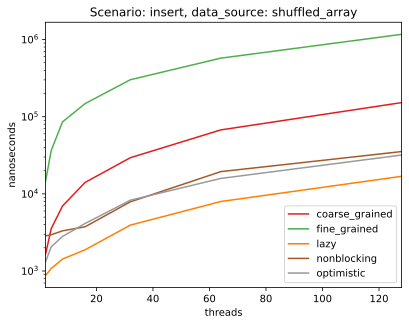
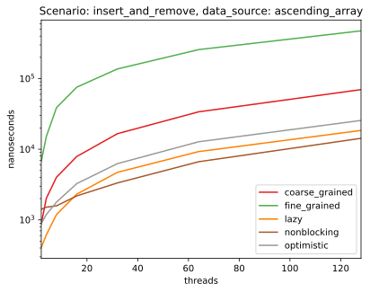
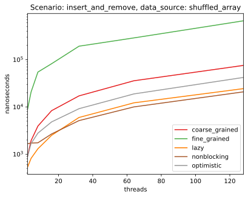

# Concurrent set data structure 
This repository contains benchmarks for different implementations of linked list based concurrent set. 
The algorithms are taken from The Art of Multiprocessor Programming, 2nd edition, 2021, by Herlihy, Shavit, Luchangco and Spear.

Two arrays are provided for each benchmark case:

- Ascending array `ascendingArray := [1, ..., 1024]` (1024 items total)
- Shuffled array `rand.Shuffle(ascendingArray)` (1024 items total)

## Concurrent write
- Each thread inserts items from the input array to the set.
- Each thread owns its own copy of input array.

## Concurrent read 
- Each thread tries to seek the items in the pre-prepared set.

  
## Concurrent write and read
- Half of the threads are inserting 1024 items to the set, while the other half is seeking for the items.

## Concurrent write and remove
- Half of the threads are inserting 1024 items to the set, while the other half is removing the items.
  
  
