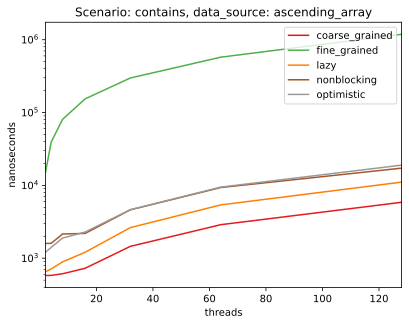

# Concurrent set data structure 
This repository contains benchmarks for different implementations of linked list based concurrent set. 
The algorithms are taken from The Art of Multiprocessor Programming, 2nd edition, 2021, by Herlihy, Shavit, Luchangco and Spear.

1. [Hardware](#Hardware)
2. [Implementations](#Implementations)
3. [Benchmarks](#Benchmarks)
4. [Conclusions](#Conclusions)

## Hardware
- AMD Ryzen 7 2700X Eight-Core Processor, 16 cores
- 32GiB DIMM DDR4 2933 MHz
- Fedora 32 (Linux kernel 5.7.8)

## Implementations

- `CoarseGrainedSyncSet`
- `FineGrainedSyncSet`
- `OptimisticSyncSet`
- `LazySyncSet`
- `NonBlockingSyncSet`

## Benchmarks

Two arrays are provided for each benchmark case:

- Ascending array `ascendingArray := [1, ..., 1024]` (1024 items total)
- Shuffled array `rand.Shuffle(ascendingArray)` (1024 items total)

In each benchmark, every thread is trying to insert/seek/remove the **full** input array.

### Concurrent write
- Each thread inserts items from the input array to the set.

### Concurrent read 
- Each thread tries to seek the items in the pre-prepared set.

  
### Concurrent write and read
- Half of the threads are inserting items from the input array to the set, while the other half is seeking for the items.

### Concurrent write and delete
- Half of the threads are inserting items from the input array to the set, while the other half is removing the items.

  
## Conclusions

* In the benchmarks implying concurrent writes and reads `LazySyncSet` showed better results. 
* In the benchmarks implying concurrent writes and deletions everything depends on the number of CPU cores: if the number of threads exceeds the number of CPU cores, `NonBlockingSyncSet` is better, otherwise use `LazySyncSet`.
* When it comes to concurrent reads (with no mutations at all), `CoarseGrainedSyncSet` wins because it acts as wait-free data structure (due to `sync.RWMutex`),
  and it's faster than optimistic implementations because it doesn't need to **validate** the discovered node.
